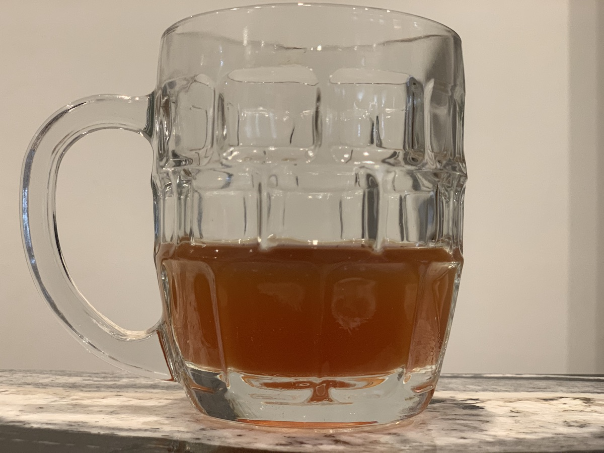

# Brew 3: Blueberry Berlinner Weisse

I want to start brewing again now I have a dedicated room. This is the first recipe in the ideas list. Unfortunately it was also started in the week that the world went into lockdown so I’m limited in ingredients. It may not turn out as expected.

## Ingredients

- 13L water
- 1.5Kg light liquid malt extract
- 1.25Kg Pilzner malt
- 750g blueberrys
- 500g lactose sugar
- 20g Hallertau Mittlefruh hops
- 15g Saaz hops
- 1 Vanilla pod

## Boil Day, 19th March

1. Clean boiler
2. Add 13 litres of water
3. Raise to ~95C
4. Add half a teaspoon of Campden power and boil for ~10 minutes
5. Leave to fall to ~70C
6. Add 1Kg of Pilzner malt in a malt bag and soak for 30 minutes 
7. Remove malt, straining hygenically (lost 1l of water)
8. Raise temperature to ~95C
9. Add 1.5kg of light liquid malt extract.
10. Add 20g of Hallertau Mittlefruh hops in strain bag.
11. Leave on light boil (#3) for 60 minutes.
12. Remove hops.
13. Stop boil.
14. Add 750g blueberry and 250g Pilsner mail in strain bag.
15. Leave on heat mat for 36 hours.

## Brew day, 21st March

1. Remove blueberry and malt, straining hygienically.
2. Raise temperature to ~95C
3. Add 15g Saaz hops in strainer.
4. Boil for 15 minutes.
5. Stop boiling, transfer (carefully) to fermenter.
6. Place in sink and dowse in cold water until temperature drops to 35C.
7. OG: 1.065 (potential 8.5% ABV)
8. Add 500g lactose sugar
9. Add split vanilla pod.
10. Activate Bavarian Wheat Yeast M20 in warm water & sugar. Add to fermenter.
11. Leave on heat mat as utility room is cold.

## Barreling Day, 2nd April

- Fermentation appears to have stopped.
- Cleaned 8 bottles, filled to neck with siphon, added 1/2 spoon of sugar.
- Siphoned rest (approx 9 pints) to pressure barrel.
- added 5 spoons sugar and 1/4 spoon citric acid to barrel, stirred lightly.

## Initial Notes

- Darker than expected.
- Hazy.
- Blueberry and sourness very subtle. Not sure if this is due to amounts used or being overpowered by lactose.
- Nice. Definitely got the creamy substance I was aiming for.
- Feels like it should be chilled.

## Lessons learnt

- Think of a better way to strain bags hygenicaly. Clean a kitchen strainer first?
- Freeze the fruit first. When it defrosts it will crack making it easier for the juices to leak into the brew. Might also make beer bluer.
- Take OG **AFTER** adding lactose sugar!
- I wanted to use Yeast WB06 to 3068 Weisen as they are good for Berliner weisse. Did it make a difference to the brew?
- 500g of lactose makes 12l of beer very sweet. Not too sweet, but at the top range of nice.
- is 1/4 spoon of citric acid enough?

## Update, 13th April

- Added 1tbsp citric acid to barrel, ~5 lites of beer.
- Rested for 30 minutes then bottled.
- This is enough to counteract the sweetness without being noticeably sour, but remains creamy.images