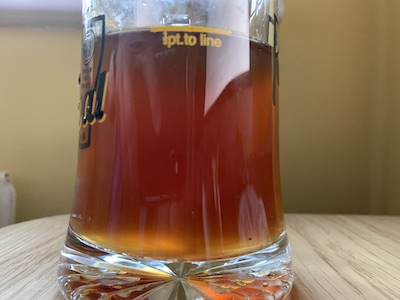
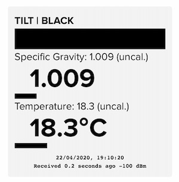
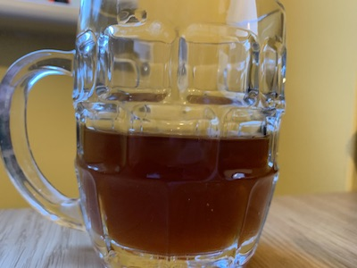

# Brew 4: Sparkling Bitter

Now I’ve got back into brewing I don’t want to stop. If I keep brewing in small batches (~10L at a time) then I can always have one beer brewing, one conditioning and one being drunk. I can also get a lot more practice in this way as well.

However, due to lock down I’m limited on equipment and ingredients (still waiting for a BrewUK delivery) so will have to get creative with what I’ve got.

## Ingredients

- 15L water
- 1.5Kg amber liquid malt extract
- 750g Pilzner malt
- 30g Saaz hops

## Brew Day, 13th April 

1. Clean Boiler
2. Add 15l of water
3. Raise to >100C
4. Add half a teaspoon of Campden power and boil for ~10 minutes
5. Leave to fall to ~66C
6. Add 750g of Pilzner malt in a malt bag and soak for 30 minutes 
7. Ensure temperate remains between 63C and 65C
8. Remove grain and strain with clean strainer.
9. Raise to boil.
10. Add 1.5kg of amber liquid malt extract.
11. Add 20g of Saaz hops in strain bag.
12. Leave on light boil (#3) for 50 minutes.
13. Add an extra 10g of Saaz hops.
14. Continue to boil for another 10 minutes.
15. Remove hops.
16. Stop boil.
17. Transfer to fermenter.
18. Place in sink and dowse in cold water until temperature drops to 35C.
19. OG: 1.030 (potential 4% ABV)
20. Activate GV12 ale yeast warm water & sugar. Add to fermenter.
21. No need for heat mat

## Bottling Day, 22nd April

- Fermentation appears to have stopped. 
- Cleaned 8 bottles, filled to neck with siphon, added 1/2 spoon of sugar.
- Stored in garage to condition.
- At this point I realise that I’ve forgotten to add the finings…

## Hydrometer

I’m not connived the initial reading from my hydrometer was correct, t’s rather weak for the malt to water ratio. We have a solution though:

I’ve finally bought a tilt hydrometer from [https://tilthydrometer.com](https://tilthydrometer.com/). Whilst the readings are rather basic compared to an informative graph it does mean I can constantly monitor the gravity to know when it’s stopped formatting, and get a more accurate estimate of the ABV. The beer is coming in at ~2.7% ABV, a light spring bitter.

## Second Fermentation, 22nd April

Why bother with a standard beer if you can do some experimentation! I seem to have a load of sparkling wine yeast which is near it’s best before data, it’d be a shame for it to go to waste but I’ve not had much success with home made with so far. Maybe I could use it with beer? From what I’ve read, whilst wine yeast would ferment with my ingredients it wouldn’t taste much like beer due to the way it breaks down the malt sugars. However, it should be possible to start a second fermentation after the first by adding the wine yeast with some refined sugar. This will make the gravity calculations more complicated if I remember to take readings at the appropriate times. I really wanted a tilt hydrometer to draw me a lovely graph but it’s still waiting on delivery.

I’ve had sparkling lagers made with champagne yeast before but due to the malt extract available this is going to be more of a bitter than a lager, and I don’t think I’ve had a sparkling bitter before. There may be a good reason why not but I’m going to try and find out.

- Add 300g dark Muscovy sugar
- Add GV10 Light sparkling wine yeast (activated in a mug)

## Barrelling Day, 29th April

- According to the hydrometer the gravity went from 1.009 up to 1.020 and back down to 1.006. This gives an extra ABV of ~1.8%, bringing the estimated total to ~4.5 ABV.
- Finings were added 36 hours earlier, I can’t say it looks any different to the previous check.
- Beer was siphoned into 10l barrel with new pin valve and 4 teaspoons of sugar added to encourage secondary (tritiary?) fermentation.
- Time will tell if the wine yeast added any sparkles once it’s rested in a barrel for a while…

## Lessons Learnt

- I need more equipment, specifically a bottle brush, bottling wand and a sediment trap.
- I have 2 hop bags, I should use them both. Trying to top up the first hop bag during a boil was a juggling act which inventively leaked hops into the boiler which clogged the tap while trying to pour into the fermenter.
- Hop pellets will remove the need for a hop bag.
- If you’ve got finings, use them.
- Instead of finings consider protafloc during the boil stage next time.