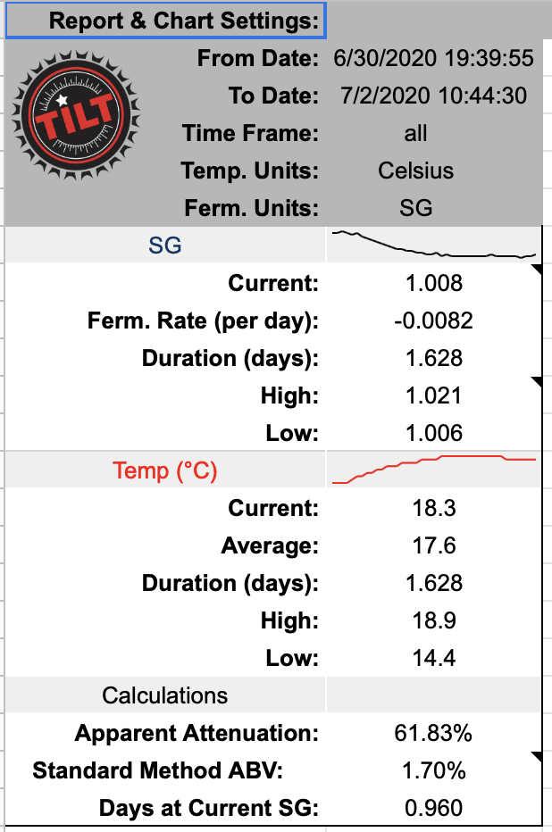
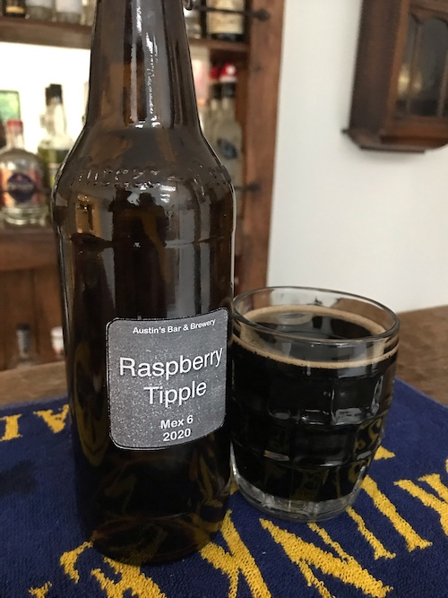
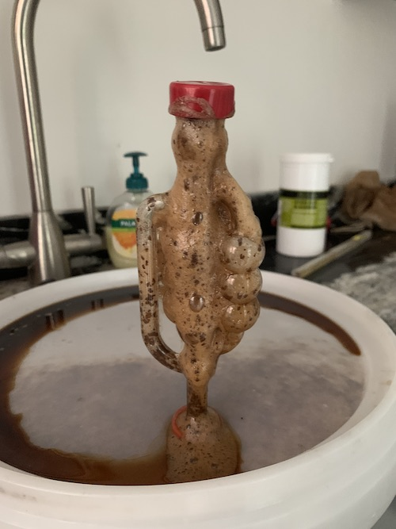

# Raspberry Milk Stout

I’ve been asked to make a beer! The previous batches are all running out, so it’s time to make something new. It has been suggested that I make a stout (because it’s summer…) and add some fruit, but make it creamy. and strong.

With that in mind, I’m going to attempt a raspberry milk stout.

## Ingredients:

- 13L water
- 1.5Kg Dark liquid malt extract
- 300g pilzner malt
- 300g chocolate malt
- 400g demerara sugar
- 1.2Kg raspberries

## Brew Day, 28th May

1. Clean boiler
2. Add 13L water
3. Add 1tbsp campden power
4. raise to 70C
5. Add the two speciality malts in a grain bag
6. Replace lid and leave boiler on #1. This keeps temperate between 66 and 68C
7. Move grain bag to (clean) strainer and wash with liquid from boiler using a (clean) jug.
8. Raise temperature to 100C
9. Add can of liquid dark malt extract
10. Add 15g northern hops in hop bag
11. Boil for 60 minutes, around 3.5 on boiler.
12. Add 15g fuggles hops to hop bag
13. add 5g Irish moss loose to boiler
14. add 150g lactose sugar to boiler
15. continue to boil for 15 minutes
16. Remove heat and hops, cool in sink
17. Transfer to fermenter, add hydrometer
18. Add 400g Demerara sugar to raise OG from 1.37 to 1.49
19. Activate and pitch M15 yeast (current temperate, 30C)
20. Move to garage (constant 19.7C)
21. After 48 hour add 1.2Kg raspberries (frozen)

## Tilt

I now have a tilt hydrometer to give me gravity and temperature readings. Unfortunately I forgot to take a screenshou of the display at the start, but it gave an OG of 1.49. The phone app will be useful to checking the temperate isn’t too high and for spotting when fermentation has stopped, but I really want a graph of alcohol production. I didn’t get around to setting up a [Tilt Pi ](https://tilthydrometer.com/products/tilt-pi-v2-buster-feb20-raspberry-pi-sd-card-image-download)until halfway through the fermentation, but it’s already very informative. Longer term I think I want to build my own Tilt Pi…

## Bottling Day, 5th July

- Tilt reports the Gravity has tailed off at 1.003
- This gives a calculated ABV of 6%, which is what I was aiming for 🙂
- A sediment catch was added to the siphon and 12 bottles were filled with 1/2 teaspoon Demerara sugar for conditioning each.
- The rest was added a a pressure barrel.
- I finally added some conditioning sugar to the barrel along with 200ml Bourbon, and then gassed with with a small cylinder of NO2.
- The bourbon should give it an extra kick, and carry on my A/B testing. I’ve not use the NO2 before so I’ll see if it makes an observable difference.

## Improving online presence

No, I’m not a media studies student or a YouTube influencer, but I received a comment about being Abe to check in my home-brews on [uptappd](https://www.untappd.com/). How easy would it be to set myself up an an untapped home brewer? Fortunately, pretty easy. I now have an [untappd brewery page](https://untappd.com/AustinsBarAndBrewery), and the[ brewery tap](https://untappd.com/v/the-drunken-duck/5623428) is also registered as a venue by adding it to [foursquare](https://www.foursquare.com/).

I thought this was pretty impressive, but immediately received a complain that there was no bar code to automatic check in. I hadn’t really considered this, but the lovely folks at untappd have some some advice to how to create a QR code [here](https://help.untappd.com/hc/en-us/articles/360033984852-Generate-a-QR-Code-to-a-Beer-Brewery-Venue-or-Check-In). I used the [unitag website](https://www.unitag.io/qrcode) to generate a QR code to the URL as specified by untappd with some selections of styles and icons. the finished code for this beer looks like this, and it works! I guess I’ll have to refine my label printing process for the future.

## Tasting Notes

The colour is black, as expected. Obviously I can’t see through to see how clear it is, but it doesn’t look cloudy. Both have a brown head but it’s more noticeable with the NO2. The raspberry smell is strong and there’s a definite taste without being overpowering. The bourbon overpowers the raspberry but doesn’t overpower the beer.

Other reviews available from [untappd](https://untappd.com/b/austin-s-bar-and-brewery-raspberry-tipple/3869789).

## Lessons learnt

- In the past I’ve lost liquid absorbed by the grain and hops. Hence starting with 13L to make 10L of beer. The use of a strainer seems to have reduced the wastage as the fermenter bucket is now full with 13L of water at the start. This makes initial fermentation messy.

- Whilst using liquid malt extract I’m limited to 1.5L of malt extract at once. If I want a stronger beer, add less water.
- Chilling in a sink takes forever, consider getting an immersion or counterflow chiller.
- Floating raspberries can interfere with hydrometers.
- A container full of raspberries also makes it impossible for Irish moss to penetrate to the beer for post-fermentation clearing.
- Registering the beer on untappd before labelling will make the QR code generation simpler. I think I need a new printer.
- a 1:10 ratio of fruit to liquid makes the beer smelly fruity and taste fruity without going a non-beer colour.
- 200ml of bourbon in 6l of beer is enough to give it a kick without overpowering everything else.
- bourbon and fruit do not mix in a beer.