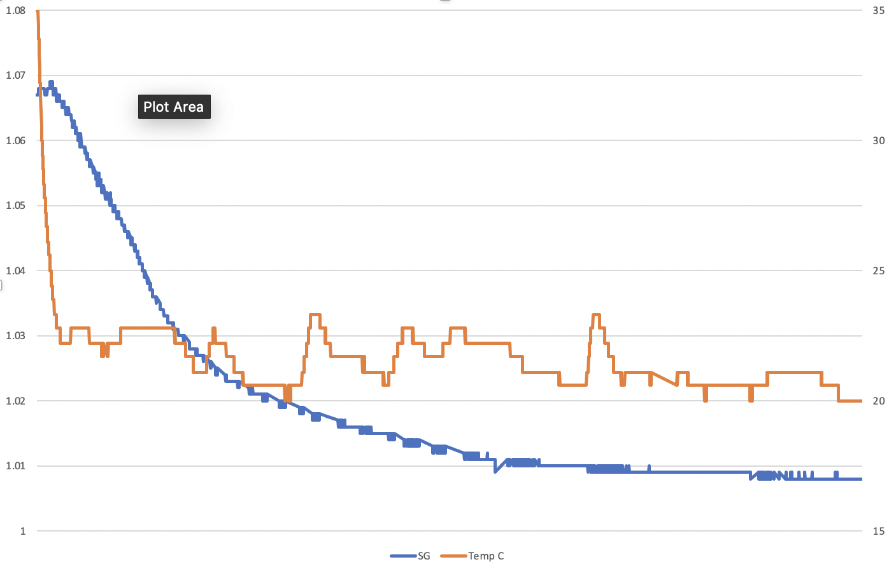
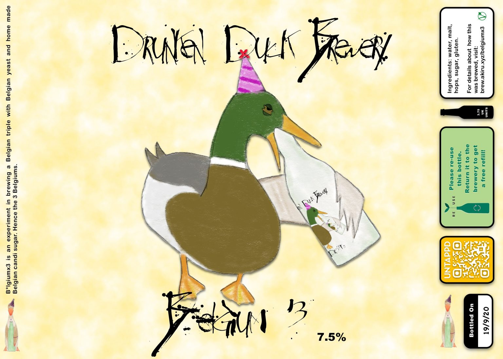

# Belgian Triple

Still keen to explore more styles, this time I’m leaning towards my favourite brewing country, Belgium. As it’s still summer I’m looking for something lighter, so a triple seems like a good place to start. Plus they’re nice and strong.

## Ingredients

- 10.5L water
- 1.5Kg light malt extract
- 750g pilzner malt
- 25g Saaz hops
- 1Kg candi sugar

## Brew Day, 6th September

1. Clean *everything*.
2. Add 10.5l water to boiler with 1 tbsp Camden powder.
3. Raise to 65C
4. Drink a Pannepot Special Reserve while waiting.
5. Turn thermostat down to 1.5 to maintain 65C
6. Add 750g pilzner malt in malt mag. Steep for 30 minutes.
7. Remove malt.
8. Raise to boil.
9. Set thermostat to 3.5 to maintain rolling boil
10. Add can of light malt extract
11. Add 25g Saaz hops in hop bag.
12. Boil for 60 minutes.
13. Make Candi…
14. Add 1tbsp Irish moss.
15. Boil for 10 minutes.
16. Add Candi.
17. Boil for 5 minutes.
18. Remove hops and chill to 25C
19. Pitch Belgian yeast M32 at 25C.

## Making candi sugar

This was doing using a recipe from [homebrewforum](https://www.thehomebrewforum.co.uk/threads/how-to-make-belgian-candi-syrup.12754/).

1. Add 1kg golden caster sugar to clean pan.
2. Add just enough warm water to dissolve.
3. Add 1 tbsp citric acid.
4. Raise to between 125C and 135C.
5. Maintain temperature for >20 minutes until rich colour.
6. Add tbsp of water to control temperature.
7. Add to boiler at correct time whilst still hot.

## Tilt

I’ve used a TiltPi with the tilt hydrometer through this process. Being able to monitor my brew gravity and temperature remotely is very useful. It also allows me to draw graphs.

## Labels

I’ve been upgrading the bottle design, with thanks to Mic. I’ve also aligned this blog, adding to untappd and label printing so they all tie to each other.

## Bottling Day, 16/9/20

- Fermentation slowed down, still breathing but gravity levelled off at 1.010
- This gives an final ABV of 7.7%
- Filled 10 bottles with bottling wand and sediment trap.
- added 1/2 tbsp golden caster sugar for priming
- Left half the liquid in fermenter for beer experiment
- Added a handful of chopped coriander and peel of an orange to give a seasonal flavour.
- Left for a week to see how fermentation continues.

## Barrelling Day, 24/9/20

- Clean barrel and piping
- Cyphon beer into pressure barrel
- Seal
- Add CO2

## Tasting Notes

- Bottles look professional
- Beer tastes like a Belgian Triple 🙂
- It could do with chilling to add an extra layer of crispness.
- Beer is lively.
- Tastes fine after 2 weeks, but will try aging for >1 month to see how it improves. 

## Lessons Learnt

- Brewing in the kitchen is more comfortable. More space, more music, more comfortable.
- Drinking whilst brewing is inspiring, and not at all dangerous.
- Make sure boiler plug is dry before plugging in.
- Bottling wand makes bottling so much easier.
- Easier to make QR codes with [https://www.qrcode-monkey.com](https://www.qrcode-monkey.com/)
- I need to make a nicer looking graph next time