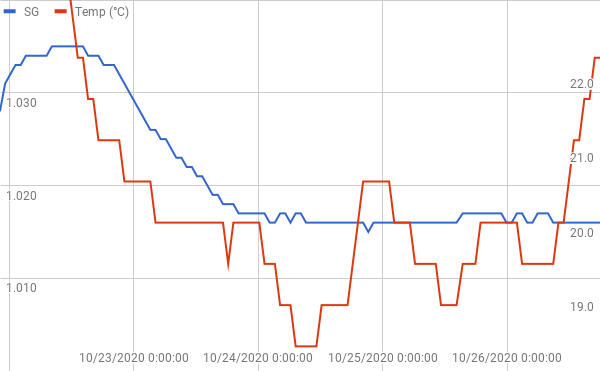

# Mild @ Breakfast

Making a last minute decision to brew some emergency beer with whatever I had my cupboard, I could be forgiven for not really knowing how it was going to turn out until it was finished, and basing my name and description on it’s eventual flavour.

## Ingredients

- 10.5L water
- 1.5Kg amber malt extract
- 450g chocolate malt
- 20g Hallertauer Mittelfrueh hops
- 10g Saas hops

## Brew Day, 21st October

1. Clean *everything*.
2. Add 10.5l water to boiler with 1 tbsp Camden powder.
3. Raise to 65C
4. Turn thermostat down to 1.5 to maintain 65C
5. Add 450g chocolate malt in malt bag. Steep for 30 minutes.
6. Remove malt.
7. Raise to boil.
8. Set thermostat to 3.5 to maintain rolling boil
9. Add can of amber malt extract
10. Add 20g Hallertauer Mittelfrueh hops in hop bag.
11. Boil for 60 minutes.
12. Swap hops for 10g Saaz hops
13. Add 1tbsp Irish moss.
14. Boil for 5 minutes.
15. Remove hops and chill to 25C
16. Pitch yeast.

## Yeast

I learnt some helpful things about pitching yeast this time.

1. If the thermometer sat the beer is 25C whilst in a cold bath, it might actually quickly raise to 50C once you take it out.
2. Yeast doesn’t like being pitched at 50C, even if the thermometer says it’s only 25C.

The Munich where beer would have given an interesting flavour, but once I’d realised my mistake I pitched a generic British Ale yeast.

## Graphing

I know, not ideal. Rushing a beer is never sensible.

## Bottling Day, 26/9/20

- Fermentation stopped designed gravity being at 1.015
- This gives an final ABV of ~2.7%
- Siphoned to barrel
- Added 100g lactose sugar to taste
- Filled 5 bottles from barrel with bottling wand and sediment trap.
- added 1/2 tbsp caster sugar to each bottle for priming
- added 7 tbsp caster sugar to barrel
- pressurised barrel with NO2.
- Left half the liquid in fermenter for beer experiment
- Added a handful of chopped coriander and peel of an orange to give a seasonal flavour.
- Left for a week to see how fermentation continues.

## Tasting Notes

- Rich, coffee, malt – hence the breakfast reference in the title.
- Mild alcohol.
- Slightly too bitter by itself, hence the lactose to add a rounding creaminess.

## Lessons Learnt

- Creating a proper recipe is preferable. Knowing what you’re producing is sensible.
- Rushing beer isn’t a good idea.
- Taking care of yeast is important.
- 500g of chocolate malt is too much is a small beer.
- Sweetening to taste does give control – lactose doesn’t need to be added at boil time.

## 