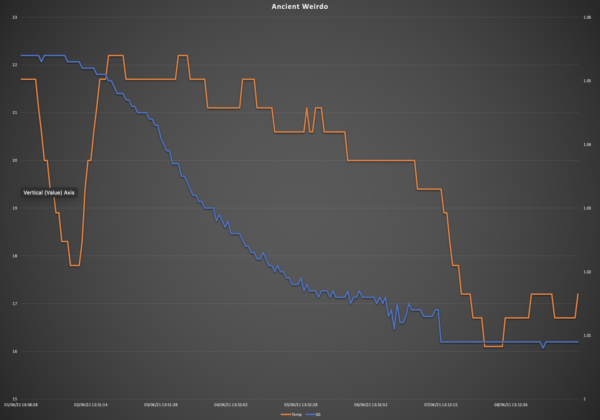
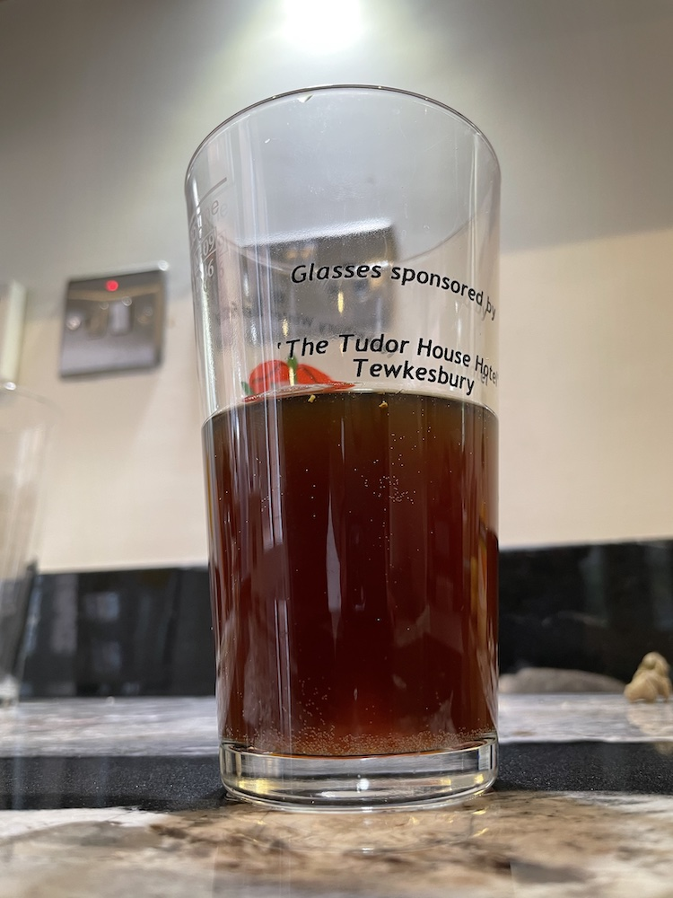
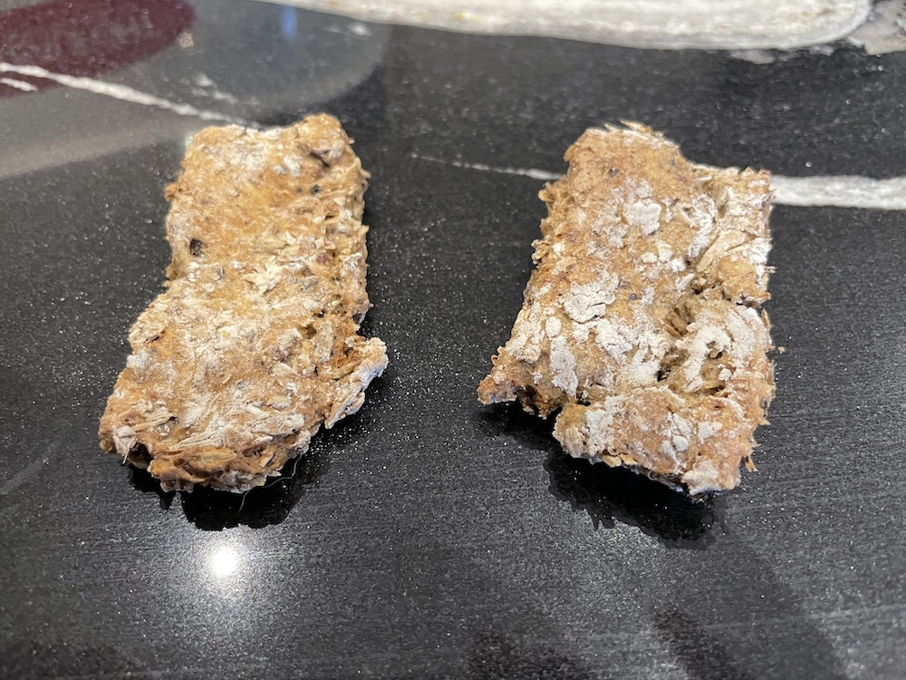
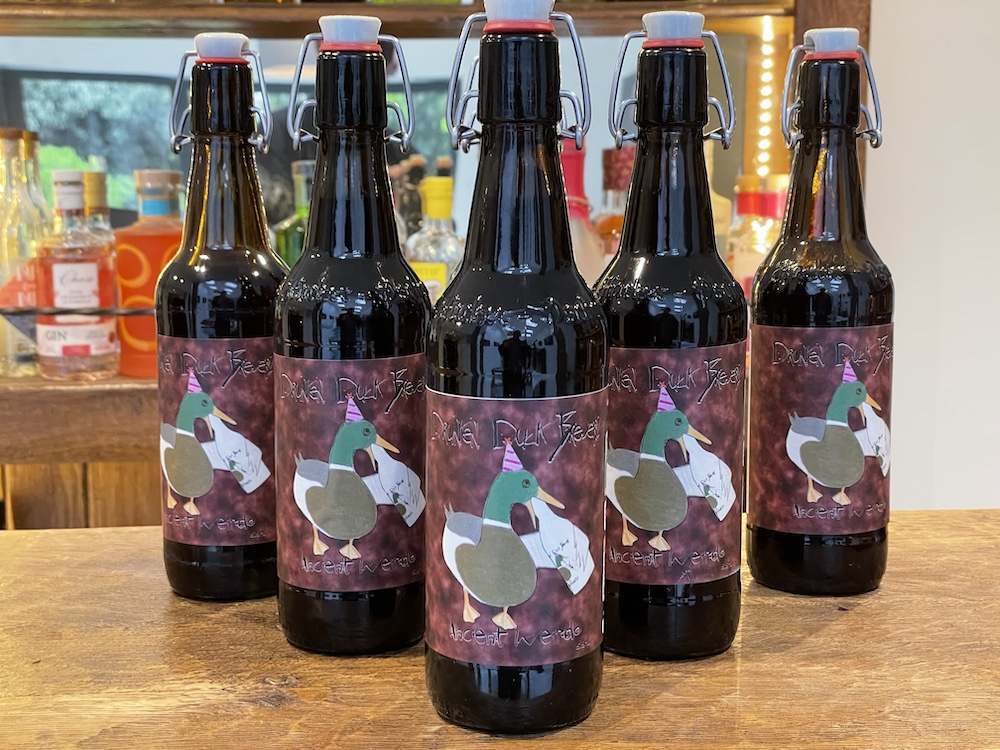

# Ancient Weirdo

I bought a mash tun! If you don't believe me, here it is.

I opted for the [Brewzilla](https://brewkegtap.co.uk/products/brewzilla-robobrew-35l-gen3-1-1-bundle) based on positive reviews and cost. Time to do a full mash brew.

I've decded to start with a cloned recipe for a familar beer, Old Peculier. Theres a few open source recipes on the Internet, but I've chosen to use [this one](http://www.britishbrewer.com/2010/02/recipe-theakston-old-peculier-version-1/), scaled down to ~10l.

As this is my first time with the brewzilla I foudn two very hepful videso on youtube from [David Heath](https://www.youtube.com/watch?v=HxLJau-hBTs) and [Grain to Glass](https://www.youtube.com/watch?v=SN2Ze9B2iZ8).

## Ingredients

- 12L water
- 1850g Crisp extra pale maris otter
- 225g Crisp crystal 240 (dark) malt
- 100g Pale chocolate malt
- 55g Rolled wheat flakes
- 15g Fuggles Hops (pellets)
- 10g Northern Brewer hops (pellets)
- Wyeast 1028 London Ale (liquid)

These were all purchased from [The Malt Miller](https://www.themaltmiller.co.uk).

## Plan

Full mash brewing is very different to what I'm used to. I've had a to learn a lot.

### Sanitistion

Sanitisation is different. After using VWP for 20 years to clean and sanitise I've read that it's not good for stainless steel.  I've now got some PBW for cleaning the mash tun, and a Chemsan for sanitisation. Apparently I don't need to sanitise anythat that touches the beer until after the boil stage. I learnt a lot from [this video](https://www.youtube.com/watch?v=8p6CmLoj0eo).

### Heating

Heating is different. In the past I've turned the boiler on and off with a switch and checked regularly with a thermometer. I have have digitial controlers with a choice of 2 heaters. a 500W heater is good for maintaining a stable temperature at anyting <80C, the 1900W heater is good at maintaining a rolling boil. Both at once are (not surprisingly) the fastest way to heat my liquor and wort. Heating comes in 3 stages.

* Mash the grain at 66C for ~1 hour.
* Heat to 77C for sparging.
* Raise to 100C for the boil

### Liquid

Liquid is different. I can't just add 12l of water and expect 12l of beer. Some will be lost in the dead space in the mash below the tap. some will be absorbed by the grain. some will evaporate during the boil. some will be trubbed post boil. some will be too yeasty to bottle. I have to calculate all these losses and top up using the sparging process to get the beer to to right volume. although most books say to use 3x as much water as grain during the mash, this won't work for me. I'm making small batches for the time being while i'm learning; this typically requires ~2kg of grain, but to cover with liquor during the mash i need at least 12l of water.

## Brew day, 1st April

* Clean mash with PBW then rinse. it been to be clean but not sanitised. Clean boiler with VWP. Clean fermenter with VWP then sanitise with Chemsan. Also clean all other equipment.
* Activiate yeast in smack pack. This will take 3 hours in a warm place to get super excited so it's good ot start early.
* Add 12L of water with a crushed campden tablet and raise to 66C with both heaters, then drop to the 500W heater to maintain 66C.
* Add the grain, ~500g at a time. Stir carefully to ensure all limps are removed and every grain is wet.
* Once all grain is added and wet, turn on the pump pipe about half power to get a relaxed whirl going and leave at 66C for an hour.
* I think that was called the mash in. Now for the mash out turn on the 1900W element and raise to 75C. Then holder in there for 10 minutes.
* At the same time heat some sparging waster on the boiler to 75C.
* After mash out, raise the gran basket and slowly rince with 2l sparge water. a clean jug is fine for this. take care to sparge evenly
* Wait until the grain has finished dripping. Raise temperature to 98C with both elements while waiting. This should take ~20 minutes.
* Remove grain pipe then add lid and boil for 60 minutes The 1900W element by itself maintains a good boil.
* Add the Northern hops at he start of the boil.
* Add the Fuggles hops 15 mintues before the end of the boil.
* Add 5g of Irish moss 5 mintues before the end of the boil.
* put the pump pipe back into the boiler for last 5 mintues to sanitise. 
* At the end of the boil, stir in the foam and give it a whirlpool effect with the pump.
* To chill, immerse the chiller and pump cold water through. use the pump to more the fluid around and over the chiller. Reduce temperature to 20C in about 20 mintues. Use a thermometer to check, do not trust the on board sensor.
* Transfer to fermenter using pump, allow to froth to airate. At this point only 9l of liquid remain.
* OG reading = 1.054
* 

## Graph

* Designated brewing room was cooler than hoped. After 24 hours was moved to a room with a more stable temperate at >20C.
* Once fermentation stopped, shook fermented to dislodge yeast from tilt hydrometer to get a better reading.

## Bottling Day, 8th April

- Final gravity was 1.009, giving a ABV of ~5.9%. Not bad.

- I was aiming for 5.4 but the reduced amount of liquid after the boil made it slightly strongher than expected.

- 4g of sugar 4 litre of beer was disolved a litle boiling water and gently stirred into fermented.

- bottles and siphon cleaned and sanitised.

- Siphoned into 15 bottles and left to rest in garage for a month.

  

## Tasting Notes

* It looks and smells exactly like the beer it's trying to copy.
* It tastes like a beer, but slightly lacking in the full flavour I was hopinh for.
* Hopefully this will develop while it rests.

## Biscuits

* Spent grain can be turned into dog biscuits.
* Mix with an equal amount of plain flou to grain in a alrge bowl then add enough eggs to make it moist yet maliable, like a dough.
* roll into 1cm thick slab and cut into dog appropriate shapes.
* bake at 200C for 30 minutes, then leave at 100C for 2 hours to fully dry out.
* The first batch may look ugly but it doesn't ge tto touch the sided when being wolfed down by a domesticated wolf.
* although safe for human consumption I wouldn't recommend it. they're a bit dry and lacking sweetness.

## Lessons learnt

* I need to mash with at least 12L of water. This is just enough to cover 2.2kg of grain. bers witha higher grain bill be require more fluid.
* The brewzilla very comfortable on the floor and a perfect height for sparging. Unfortunately all the controls are at the bottom which means I have to lay on the floor to operate it. A small sturdy table would be useful, but this has to be strong enough to hold a mash tun ful of hot liquid. A £4 table from Ikea will not do.
* Smack packs require more than a gentle slap. Next time give it a damn good pointing with a large lump of hard wood.
* 12L is minimum amount to liquor to start a brew with. ~2l is lost during the mash stage. ~3l is lost during the boil. ~1 is lost during bottling. If I want 12l at the end of the process I should sparge with ~6l of liquor.
* 12 of liquor may be enough fluid to ocver the grain during the mash but does not leave enough to cover the immersion chiller. The chiller gets more coverage in a 13l fermenter but does bring some waste proruct when moveing from the one to the other. only chill in one vessel, preferably the mash / kettle.
* Dogs like biscuits. make more next time.

