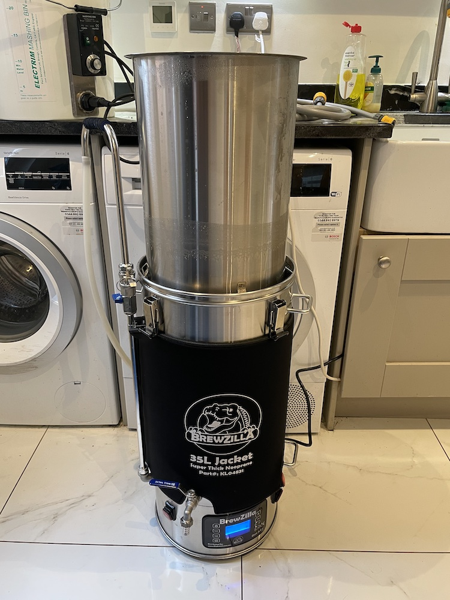

# Ancient Weirdo

I bought a mash tun! If you don't believe me, here it is.

I opted for the [Brewzilla](https://brewkegtap.co.uk/products/brewzilla-robobrew-35l-gen3-1-1-bundle) based on positive reviews and cost. Time to do a full mash brew.

I've decded to start with a cloned recipe for a familar beer, Old Peculier. Theres a few open source recipes on the Interent, but I've chosen to use [this one](http://www.britishbrewer.com/2010/02/recipe-theakston-old-peculier-version-1/), scaled down to ~10l.

## Ingredients

- 12L water
- 1850g Crisp extra pale maris otter
- 225g Crisp crystal 240 (dark) malt
- 100g Pale chocolate malt
- 55g Rolled wheat flakes
- 15g Fuggles Hops (pellets)
- 10g Northern Brewer hops (pellets)
- Wyeast 1028 London Ale (liquid)

## Plan

Full mash brewgin is very different to what I'm used to. I've had a to learn a lot.

Sanitisation is different. After using VWP for 20 years to clean and sanitise I've read that it's not good for stainless steel.  I've now got some PBW for cleaning the mash tun, and a seperste chemical for sanitisation. Apparnetly i dont' need to sanitise anythat that touches the beer until afer the boil stage.

Heating is different. In the past I've turned the boiler on and off with a switch and checked regularly with a thermometer. I have have digitial controlers with a choice of 2 heaters. a 500W heater is good for maintaining a stable temperature at anyting <80C, the 1900W heater is good at maintaining a rolling boil. Both at once are (not surprisingly) the fastest way to heat my liquor and wort. 

Heating comes in 3 stages.

* Mash the grain at 66C for ~1 hour.
* Heat to 77C for sparging.
* Rase to 100C for boiling

Liquid is different. I can't just add 12l of water and expect 12l of beer. Some will  be lost in the dead space in teh mash below the tap. some will be absorbed by the grain. some will evaporate during the boil. some will be trubbed post boil. some will be too yeasty to bottle. I have to calculate all these losses and top of using the sparging process to get the beer to to right volume. although most books say to use 3x as much water as grain during the mash, this won't work for me. I'm making small batches fo rhte time beign while i'm learning. this typvialyl requires ~2kg of grain, but to cover with liquor during the mash i need at least 12l of water.

TBC....